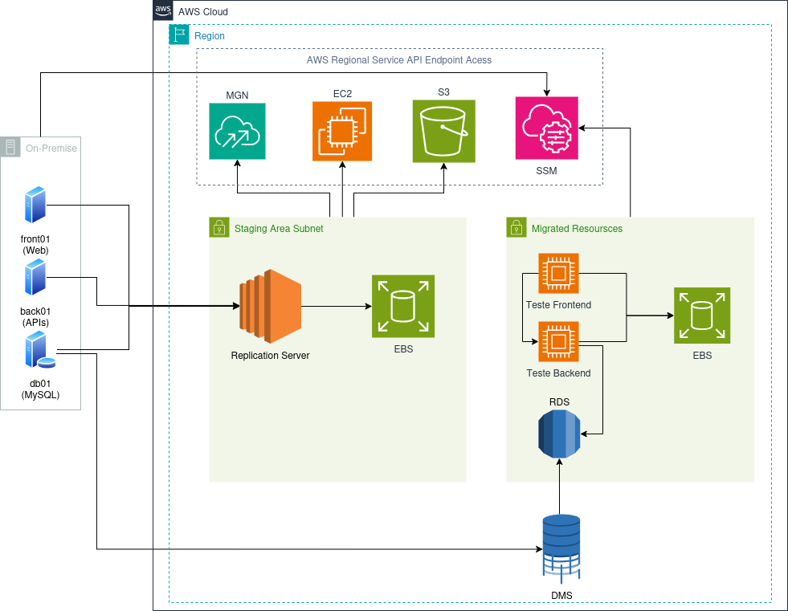
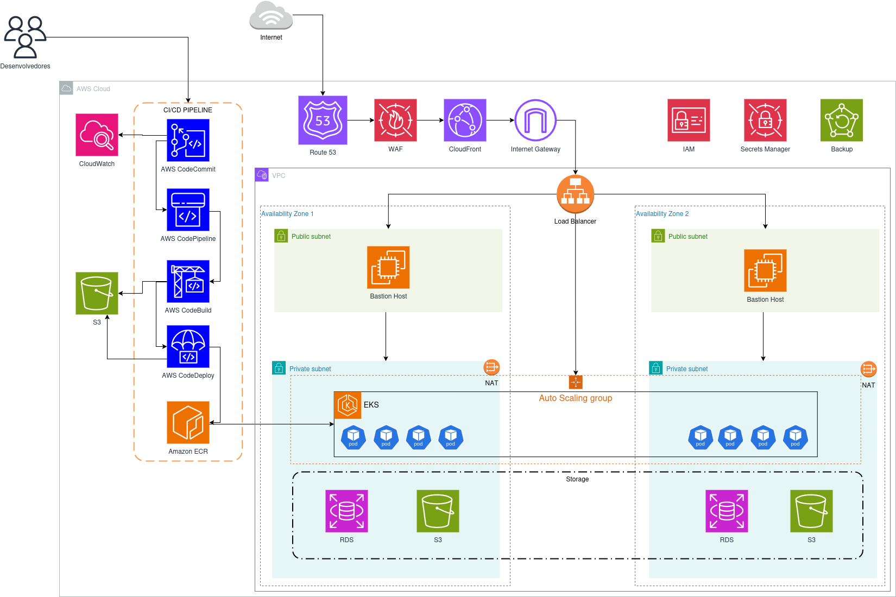

# Documentação do Projeto de Migração e Modernização da Fast Engineering S/A

## Visão Geral

A empresa Fast Engineering S/A está passando por um crescimento acelerado em seu eCommerce, resultando em um aumento significativo no volume de acessos e transações. A infraestrutura atual não consegue mais atender essa demanda de forma eficiente, impactando a escalabilidade e o desempenho da plataforma. Para solucionar esse desafio, será implementada uma nova arquitetura baseada em AWS, garantindo alta disponibilidade, segurança e performance. O processo será conduzido em duas etapas: primeiro, uma migração Lift-and-Shift para a nuvem, seguida por uma modernização completa utilizando Kubernetes e serviços gerenciados.

## Infraestrutura Atual

A infraestrutura atual é composta por três servidores, cada um com funções específicas dentro da arquitetura da aplicação:

- **Banco de Dados**: Servidor dedicado ao MySQL, armazenando aproximadamente 500GB de dados, com 10GB de RAM e 3 vCPUs.
- **Frontend**: Servidor responsável pela aplicação React, utilizando 5GB de armazenamento, 2GB de RAM e 1 vCPU.
- **Backend**: Servidor que hospeda 3 APIs, além de atuar como balanceador de carga via Nginx e armazenar arquivos estáticos, como imagens e links. Possui 5GB de armazenamento, 4GB de RAM e 2 Core CPU.

Essa estrutura enfrenta desafios de escalabilidade e desempenho, sendo necessária uma migração para a AWS para garantir maior eficiência e disponibilidade.

## Etapa 1: Migração "Lift-and-Shift" (As-Is)

A migração "Lift-and-Shift", também conhecida como "rehosting" ou "as-is", é uma estratégia de migração para a nuvem que envolve mover aplicativos e dados de um ambiente local para a nuvem com o mínimo de alterações possível. O objetivo principal é replicar a infraestrutura existente na nuvem, mantendo a mesma arquitetura e configuração.

### O que é "Lift-and-Shift"?

Imagine que você está mudando de casa. Em vez de reformar completamente a nova casa, você simplesmente pega seus móveis e os coloca nos mesmos lugares que estavam na casa antiga. Isso é essencialmente o que o "Lift-and-Shift" faz com a sua infraestrutura de TI.

### O que será utilizado?

- AWS MGN (Application Migration Service)
- AWS Replication Agent
- AWS EBS (Elastic Block Store)
- AWS DMS (Database Migration Service)
- Load Balancer

### Atividades Necessárias

#### Migração "Lift-and-Shift": Passo a Passo

1. **Preparação do Ambiente On-Premise e AWS**:
    - **Instalação do Agente de Replicação AWS**:
        - Em cada servidor local (front01, back01, db01), instale o AWS Replication Agent. Este software estabelecerá a conexão segura com o AWS Migration Service (MGN).
    - **Comunicação Segura com o AWS MGN**:
        - Certifique-se de que os servidores locais e os servidores de replicação MGN, localizados na sub-rede de área de preparação, possam se comunicar com os endpoints do AWS MGN na porta 443. Essa comunicação é essencial para autenticação, configuração e monitoramento contínuo.
    - **Acesso ao Armazenamento S3**:
        - Ao iniciar, os servidores de replicação e conversão acessarão um bucket S3 para baixar o software necessário e os arquivos de configuração.

2. **Replicação e Migração dos Servidores**:
    - **Replicação Contínua com MGN**:
        - A conexão entre os servidores locais e os servidores de replicação é estabelecida via AWS Direct Connect ou VPN, garantindo a segurança dos dados.
        - Os dados são criptografados em trânsito usando criptografia AES de 256 bits.
        - Volumes Elastic Block Store (EBS) são criados com o mesmo tamanho dos discos originais, mantendo os dados sincronizados na AWS.
    - **Migração do Banco de Dados com DMS**:
        - Para o banco de dados (MySQL), utilize o AWS Database Migration Service (DMS).
        - O banco de dados será migrado para o Amazon RDS, aproveitando os benefícios de um serviço gerenciado.
    - **Snapshots e Conectividade com API EC2**:
        - O servidor de replicação realizará chamadas de API para criar snapshots dos volumes EBS de preparação durante a replicação.
        - Certifique-se de que a conectividade com o endpoint da API EC2 na porta 443 esteja ativa.

3. **Testes**:
    - **Instâncias de Teste**:
        - A sub-rede de área de testes iniciará instâncias EC2 com base no modelo de execução configurado.
        - Essas instâncias se conectarão a cópias atualizadas dos volumes EBS da área de preparação.
        - Importante: essas cópias não serão mais sincronizadas com os servidores locais.
    - **Gerenciamento com AWS Systems Manager (SSM)**:
        - Utilize o AWS Systems Manager (SSM) para gerenciar as instâncias de teste de forma automatizada, facilitando a configuração e o monitoramento.

## Modernização: Ferramentas

- **AWS CodeCommit**: Repositório de código fonte.
- **AWS CodePipeline**: Serviço de entrega contínua para automação de pipelines de lançamento.
- **AWS CodeBuild**: Serviço de construção de código para compilar e testar aplicações.
- **AWS CodeDeploy**: Serviço de implantação de código para automatizar a implantação de aplicações.
- **Amazon ECR (Elastic Container Registry)**: Registro de imagens Docker.
- **Amazon EKS (Elastic Kubernetes Service)**: Serviço gerenciado de Kubernetes.
- **Amazon RDS (Relational Database Service)**: Serviço de banco de dados relacional gerenciado.
- **Amazon S3 (Simple Storage Service)**: Serviço de armazenamento de objetos.
- **CloudWatch**: Serviço de monitoramento e observabilidade.
- **Route 53**: Serviço de DNS (Sistema de Nomes de Domínio).
- **WAF (Web Application Firewall)**: Firewall de aplicações web.
- **CloudFront**: Serviço de rede de entrega de conteúdo (CDN).
- **Internet Gateway**: Componente de rede para comunicação com a Internet.
- **IAM (Identity and Access Management)**: Serviço de gerenciamento de identidade e acesso.
- **Secrets Manager**: Serviço para gerenciamento de segredos.
- **Load Balancer**: Distribuidor de tráfego.
- **NAT (Network Address Translation)**: Serviço de tradução de endereços de rede.
- **Backup**: Serviço de backup.

## Modernização: Explicação das Ferramentas

1. **AWS CodeCommit**:
    - **O que faz**: É um serviço de controle de versão totalmente gerenciado que hospeda repositórios Git privados.
    - **Importância**: Permite armazenar e versionar o código fonte da aplicação, facilitando a colaboração entre desenvolvedores e o controle de alterações.

2. **AWS CodePipeline**:
    - **O que faz**: É um serviço de entrega contínua que automatiza o processo de lançamento de software.
    - **Importância**: Cria pipelines de CI/CD (Integração Contínua/Entrega Contínua) que automatizam a construção, teste e implantação da aplicação, acelerando o ciclo de desenvolvimento e reduzindo erros.

3. **AWS CodeBuild**:
    - **O que faz**: É um serviço de construção de código que compila o código fonte, executa testes e produz pacotes de software prontos para implantação.
    - **Importância**: Automatiza a fase de construção do pipeline de CI/CD, garantindo que o código seja compilado e testado de forma consistente.

4. **AWS CodeDeploy**:
    - **O que faz**: É um serviço de implantação de código que automatiza a implantação de aplicações em instâncias EC2, funções Lambda ou contêineres ECS.
    - **Importância**: Automatiza a fase de implantação do pipeline de CI/CD, garantindo que a aplicação seja implantada de forma segura e consistente em diferentes ambientes.

5. **Amazon ECR (Elastic Container Registry)**:
    - **O que faz**: É um serviço de registro de contêineres Docker totalmente gerenciado.
    - **Importância**: Permite armazenar e gerenciar imagens Docker, que são usadas para empacotar e distribuir a aplicação em contêineres.

6. **Amazon EKS (Elastic Kubernetes Service)**:
    - **O que faz**: É um serviço gerenciado de Kubernetes que facilita a implantação, o gerenciamento e o escalonamento de aplicações em contêineres.
    - **Importância**: Permite orquestrar contêineres de forma eficiente, garantindo alta disponibilidade, escalabilidade e resiliência da aplicação.

7. **Amazon RDS (Relational Database Service)**:
    - **O que faz**: É um serviço de banco de dados relacional gerenciado que oferece suporte a vários mecanismos de banco de dados, como MySQL, PostgreSQL e Aurora.
    - **Importância**: Fornece um banco de dados gerenciado, eliminando a necessidade de gerenciar a infraestrutura subjacente e garantindo alta disponibilidade e escalabilidade.

8. **Amazon EFS (Elastic File System)**:
    - **O que faz**: É um serviço de armazenamento de arquivos escalável e elástico para instâncias EC2.
    - **Importância**: Permite compartilhar arquivos entre várias instâncias EC2, facilitando a criação de aplicações distribuídas.

9. **Amazon S3 (Simple Storage Service)**:
    - **O que faz**: É um serviço de armazenamento de objetos altamente escalável e durável.
    - **Importância**: Permite armazenar e recuperar qualquer tipo de dado, como arquivos estáticos, backups e logs.

10. **CloudWatch**:
    - **O que faz**: É um serviço de monitoramento e observabilidade que coleta métricas, logs e eventos de recursos AWS e aplicações.
    - **Importância**: Permite monitorar a saúde e o desempenho da aplicação, identificar problemas e tomar decisões informadas.

11. **Route 53**:
    - **O que faz**: É um serviço de DNS (Sistema de Nomes de Domínio) altamente disponível e escalável.
    - **Importância**: Permite gerenciar nomes de domínio e rotear o tráfego para a aplicação na AWS.

12. **WAF (Web Application Firewall)**:
    - **O que faz**: É um firewall de aplicações web que protege a aplicação contra ataques comuns, como injeção de SQL e cross-site scripting.
    - **Importância**: Garante a segurança da aplicação, protegendo-a contra ameaças e vulnerabilidades.

13. **CloudFront**:
    - **O que faz**: É um serviço de rede de entrega de conteúdo (CDN) que acelera a entrega de conteúdo para usuários em todo o mundo.
    - **Importância**: Melhora o desempenho da aplicação, reduzindo a latência e o tempo de carregamento para usuários geograficamente dispersos.

14. **Internet Gateway**:
    - **O que faz**: É um componente de rede que permite a comunicação entre a VPC e a Internet.
    - **Importância**: Permite que a aplicação acesse a Internet e que os usuários acessem a aplicação a partir da Internet.

15. **IAM (Identity and Access Management)**:
    - **O que faz**: É um serviço de gerenciamento de identidade e acesso que permite controlar o acesso a recursos AWS.
    - **Importância**: Garante a segurança da aplicação, concedendo acesso apenas a usuários e serviços autorizados.

16. **Secrets Manager**:
    - **O que faz**: É um serviço que permite gerenciar segredos, como senhas, chaves de API e certificados.
    - **Importância**: Melhora a segurança da aplicação, evitando que segredos sejam armazenados em código ou em arquivos de configuração.

17. **Load Balancer**:
    - **O que faz**: Distribui o tráfego de entrada entre várias instâncias EC2 ou contêineres.
    - **Importância**: Melhora a disponibilidade e a escalabilidade da aplicação, distribuindo a carga de trabalho de forma uniforme.

18. **NAT (Network Address Translation)**:
    - **O que faz**: Permite que instâncias em sub-redes privadas acessem a Internet sem serem acessíveis a partir da Internet.
    - **Importância**: Melhora a segurança da aplicação, ocultando as instâncias privadas da Internet.

19. **Backup**:
    - **O que faz**: É um serviço que permite fazer backup e restaurar dados de recursos AWS.
    - **Importância**: Garante a segurança dos dados, permitindo a recuperação em caso de falha ou desastre.