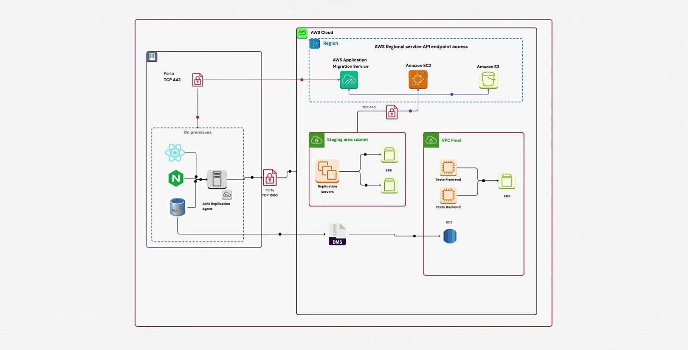
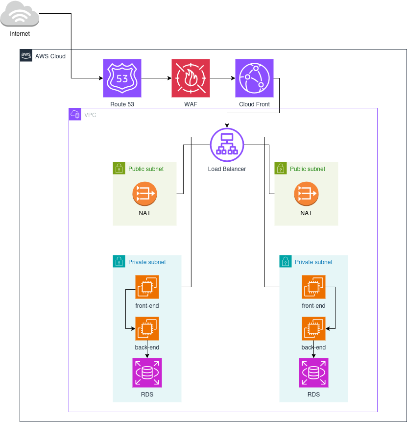
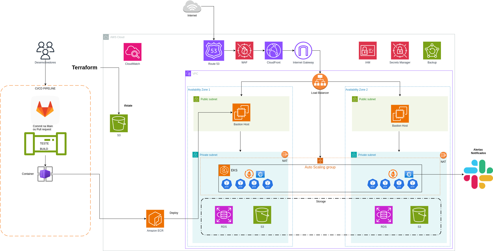

# Documentação do Projeto de Migração e Modernização da Fast Engineering S/A

## Visão Geral

A empresa Fast Engineering S/A está passando por um crescimento acelerado em seu eCommerce, resultando em um aumento significativo no volume de acessos e transações. A infraestrutura atual não consegue mais atender essa demanda de forma eficiente, impactando a escalabilidade e o desempenho da plataforma. Para solucionar esse desafio, será implementada uma nova arquitetura baseada em AWS, garantindo alta disponibilidade, segurança e performance. O processo será conduzido em duas etapas: primeiro, uma migração Lift-and-Shift para a nuvem, seguida por uma modernização completa utilizando Kubernetes e serviços gerenciados.

## Infraestrutura Atual

A infraestrutura atual é composta por três servidores, cada um com funções específicas dentro da arquitetura da aplicação:

- **Banco de Dados**: Servidor dedicado ao MySQL, armazenando aproximadamente 500GB de dados, com 10GB de RAM e 3 vCPUs.
- **Frontend**: Servidor responsável pela aplicação React, utilizando 5GB de armazenamento, 2GB de RAM e 1 vCPU.
- **Backend**: Servidor que hospeda 3 APIs, além de atuar como balanceador de carga via Nginx e armazenar arquivos estáticos, como imagens e links. Possui 5GB de armazenamento, 4GB de RAM e 2 Core CPU.

Essa estrutura enfrenta desafios de escalabilidade e desempenho, sendo necessária uma migração para a AWS para garantir maior eficiência e disponibilidade.

## Etapa 1: Migração "Lift-and-Shift" (As-Is)

A migração "Lift-and-Shift", também conhecida como "rehosting" ou "as-is", é uma estratégia de migração para a nuvem que envolve mover aplicativos e dados de um ambiente local para a nuvem com o mínimo de alterações possível. O objetivo principal é replicar a infraestrutura existente na nuvem, mantendo a mesma arquitetura e configuração.

### O que é "Lift-and-Shift"?

Imagine que você está mudando de casa. Em vez de reformar completamente a nova casa, você simplesmente pega seus móveis e os coloca nos mesmos lugares que estavam na casa antiga. Isso é essencialmente o que o "Lift-and-Shift" faz com a sua infraestrutura de TI.

### O que será utilizado?

| Ícone | Nome | Descrição |
|------------|------------------------------|------------------------------|
|  | **AWS Application Migration Service** | Migração de aplicações on-premises para a AWS |
|  | **Amazon EC2** | Instâncias de servidores virtuais na AWS |
|  | **Amazon S3** | Armazenamento escalável de objetos na nuvem |
|  | **Amazon Elastic Block Store** | Armazenamento em bloco para uso com EC2 |
|  | **Amazon RDS** | Banco de dados relacional gerenciado |
|  | **AWS Database Migration Service** | Migração de bancos de dados para a AWS |

### Pré-requisitos

- **Sub-rede da Área de Teste**: Antes de configurar o Application Migration Service, crie uma sub-rede para ser usada como área de preparação para dados replicados dos seus servidores de origem para AWS (ou seja, um plano de dados). Você deve especificar essa sub-rede no modelo de Configurações de Replicação ao acessar pela primeira vez o console do Application Migration Service.
- **Requisitos de Rede**:
    - Os servidores de replicação que são iniciados pelo Serviço de Migração de Aplicativos na sub-rede da sua área de armazenamento precisam ser capazes de enviar dados para o endpoint da API do Serviço de Migração de Aplicativos em `https://mgn.<region>.amazonaws.com/`, onde `<region>` é o código da região da AWS para a qual você está replicando (por exemplo, se sua aplicação está no norte da virgina: `https://mgn.us-east-1.amazonaws.com`).
    - O instalador do AWS Replication Agent deve ter acesso à URL do bucket do Amazon S3 da região da AWS que você está usando com o Application Migration Service.
    - A sub-rede da área de armazenamento deve ter acesso ao Amazon S3.
    - Os servidores de origem nos quais o Agente de AWS Replicação está instalado devem ser capazes de enviar dados para os servidores de replicação na sub-rede da área de armazenamento e para o endpoint da API do Application Migration Service em `https://mgn.<region>.amazonaws.com/`.

### Atividades Necessárias

#### Migração "Lift-and-Shift": Passo a Passo

1. **Preparação do Ambiente On-Premise e AWS**:
    - **Criar Sub-rede da Área de Teste**:
        - No console da AWS, navegue até o serviço VPC.
        - Crie uma nova sub-rede dedicada para a área de preparação.
        - Anote o ID da sub-rede, pois você precisará especificá-lo no modelo de Configurações de Replicação.
    - **Instalação do Agente de Replicação AWS**:
        - Em cada servidor local (front01, back01, db01), baixe e instale o AWS Replication Agent.
        - O instalador do agente deve ter acesso à URL do bucket do Amazon S3 da região da AWS que você está usando.
    - **Configuração de Rede**:
        - Certifique-se de que os servidores locais e os servidores de replicação MGN possam se comunicar com os endpoints do AWS MGN na porta 443.
        - Configure regras de segurança no seu VPC para permitir o tráfego necessário.

2. **Configuração dos Endpoints de Interface**:
    - **Endpoint da Interface para o Application Migration Service**:
        - Abra o console da Amazon VPC.
        - No painel de navegação, escolha Endpoints e depois Create Endpoint.
        - Em Service category, escolha AWS Services.
        - Em Service Name, digite `com.amazonaws.<region>.mgn` e selecione Interface como o tipo.
        - Para VPC, selecione a VPC de destino.
        - Em Subnets, selecione as sub-redes onde criar as interfaces de rede do endpoint.
        - Ative o DNS privado para o endpoint da interface.
        - Selecione um grupo de segurança que permita a entrada da sub-rede VPC da área de armazenamento via TCP 443.
        - Escolha Create Endpoint.
    - **Endpoint da Interface para a Amazon EC2**:
        - Siga as mesmas instruções acima, mas em Service Name, digite `com.amazonaws.<region>.ec2`.
    - **Endpoint da Interface para o Amazon S3**:
        - Siga as mesmas instruções acima, mas em Service Name, digite `com.amazonaws.<region>.s3`.
        - Desmarque Habilitar nome DNS, pois o DNS privado não é compatível com endpoints da interface do Amazon S3.
    - **Endpoint do Gateway do Amazon S3**:
        - Crie um endpoint de gateway Amazon S3 na VPC à qual a sub-rede da área de teste pertence.
        - Atualize as tabelas de rotas da sub-rede de teste com as rotas relevantes.

3. **Replicação e Migração dos Servidores**:
    - **Replicação Contínua com MGN**:
        - Estabeleça a conexão entre os servidores locais e os servidores de replicação via AWS Direct Connect ou VPN.
        - Os dados são criptografados em trânsito usando criptografia AES de 256 bits.
        - Volumes Elastic Block Store (EBS) são criados com o mesmo tamanho dos discos originais, mantendo os dados sincronizados na AWS.
    - **Migração do Banco de Dados com DMS**:
        - Utilize o AWS Database Migration Service (DMS) para migrar o banco de dados MySQL para o Amazon RDS.
        - Configure o DMS para replicar os dados do banco de dados de origem para o RDS.
    - **Snapshots e Conectividade com API EC2**:
        - O servidor de replicação realizará chamadas de API para criar snapshots dos volumes EBS de preparação durante a replicação.
        - Certifique-se de que a conectividade com o endpoint da API EC2 na porta 443 esteja ativa.

4. **Testes**:
    - **Instâncias de Teste**:
        - Inicie instâncias EC2 na sub-rede de área de testes com base no modelo de execução configurado.
        - Essas instâncias se conectarão a cópias atualizadas dos volumes EBS da área de preparação.
        - Importante: essas cópias não serão mais sincronizadas com os servidores locais.
    - **Gerenciamento com AWS Systems Manager (SSM)**:
        - Utilize o AWS Systems Manager (SSM) para gerenciar as instâncias de teste de forma automatizada, facilitando a configuração e o monitoramento.

## Pós migração:
Após fazer a migração e realizar todos os testes, a estrutura utilizará as seguintes ferramentas:
| Ícone | Nome | Descrição |
|---|---|---|
|  | Route 53 | Serviço de DNS (Sistema de Nomes de Domínio). |
|  | WAF (Web Application Firewall) | Firewall de aplicações web. |
|  | CloudFront | Serviço de rede de entrega de conteúdo (CDN). |
|  | Load Balancer | Distribuidor de tráfego. |
|  | NAT (Network Address Translation) | Serviço de tradução de endereços de rede. |
|  | RDS (Relational Database Service) | Serviço de banco de dados relacional gerenciado. |

### Diagrama após a migração

## Modernização: Ferramentas

| Ícone | Nome | Descrição |
|---|---|---|
|  | Amazon ECR (Elastic Container Registry) | Registro de imagens Docker. |
|  | Amazon EKS (Elastic Kubernetes Service) | Serviço gerenciado de Kubernetes. |
|  | Amazon RDS (Relational Database Service) | Serviço de banco de dados relacional gerenciado. |
|  | Amazon S3 (Simple Storage Service) | Serviço de armazenamento de objetos. |
|  | CloudWatch | Serviço de monitoramento e observabilidade. |
|  | Route 53 | Serviço de DNS (Sistema de Nomes de Domínio). |
|  | WAF (Web Application Firewall) | Firewall de aplicações web. |
|  | CloudFront | Serviço de rede de entrega de conteúdo (CDN). |
|  | Internet Gateway | Componente de rede para comunicação com a Internet. |
|  | IAM (Identity and Access Management) | Serviço de gerenciamento de identidade e acesso. |
|  | Secrets Manager | Serviço para gerenciamento de segredos. |
|  | Load Balancer | Distribuidor de tráfego. |
|  | NAT (Network Address Translation) | Serviço de tradução de endereços de rede. |
|  | Backup | Serviço de backup. |

## Modernização: Explicação das Ferramentas

1. **Amazon ECR (Elastic Container Registry)**:
    - **O que faz**: É um serviço de registro de contêineres Docker totalmente gerenciado.
    - **Importância**: Permite armazenar e gerenciar imagens Docker, que são usadas para empacotar e distribuir a aplicação em contêineres.

2. **Amazon EKS (Elastic Kubernetes Service)**:
    - **O que faz**: É um serviço gerenciado de Kubernetes que facilita a implantação, o gerenciamento e o escalonamento de aplicações em contêineres.
    - **Importância**: Permite orquestrar contêineres de forma eficiente, garantindo alta disponibilidade, escalabilidade e resiliência da aplicação.

3. **Amazon RDS (Relational Database Service)**:
    - **O que faz**: É um serviço de banco de dados relacional gerenciado que oferece suporte a vários mecanismos de banco de dados, como MySQL, PostgreSQL e Aurora.
    - **Importância**: Fornece um banco de dados gerenciado, eliminando a necessidade de gerenciar a infraestrutura subjacente e garantindo alta disponibilidade e escalabilidade.

4. **Amazon S3 (Simple Storage Service)**:
    - **O que faz**: É um serviço de armazenamento de objetos altamente escalável e durável.
    - **Importância**: Permite armazenar e recuperar qualquer tipo de dado, como arquivos estáticos, backups e logs.

5. **CloudWatch**:
    - **O que faz**: É um serviço de monitoramento e observabilidade que coleta métricas, logs e eventos de recursos AWS e aplicações.
    - **Importância**: Permite monitorar a saúde e o desempenho da aplicação, identificar problemas e tomar decisões informadas.

6. **Route 53**:
    - **O que faz**: É um serviço de DNS (Sistema de Nomes de Domínio) altamente disponível e escalável.
    - **Importância**: Permite gerenciar nomes de domínio e rotear o tráfego para a aplicação na AWS.

7. **WAF (Web Application Firewall)**:
    - **O que faz**: É um firewall de aplicações web que protege a aplicação contra ataques comuns, como injeção de SQL e cross-site scripting.
    - **Importância**: Garante a segurança da aplicação, protegendo-a contra ameaças e vulnerabilidades.

8. **CloudFront**:
    - **O que faz**: É um serviço de rede de entrega de conteúdo (CDN) que acelera a entrega de conteúdo para usuários em todo o mundo.
    - **Importância**: Melhora o desempenho da aplicação, reduzindo a latência e o tempo de carregamento para usuários geograficamente dispersos.

9. **Internet Gateway**:
    - **O que faz**: É um componente de rede que permite a comunicação entre a VPC e a Internet.
    - **Importância**: Permite que a aplicação acesse a Internet e que os usuários acessem a aplicação a partir da Internet.

10. **IAM (Identity and Access Management)**:
    - **O que faz**: É um serviço de gerenciamento de identidade e acesso que permite controlar o acesso a recursos AWS.
    - **Importância**: Garante que **CodePipeline, EKS, RDS, S3** e outros serviços só possam ser acessados por quem tem permissão.  

11. **Secrets Manager**:
    - **O que faz**: É um serviço que permite gerenciar segredos, como senhas, chaves de API e certificados.
    - **Importância**: Melhora a segurança da aplicação, evitando que segredos sejam armazenados em código ou em arquivos de configuração.

12. **Load Balancer**:
    - **O que faz**: Distribui o tráfego de entrada entre várias instâncias EC2 ou contêineres.
    - **Importância**: Melhora a disponibilidade e a escalabilidade da aplicação, distribuindo a carga de trabalho de forma uniforme.
      
17. **Bastion Host**:
    - **O que faz**: São **servidores intermediários** para SSH dentro da VPC, evitando exposição direta das instâncias privadas à internet.  
    - **Importância**: Os administradores se conectam ao Bastion Host para acessar os nós do **EKS**.  

13. **NAT (Network Address Translation)**:
    - **O que faz**: Permite que instâncias em sub-redes privadas acessem a Internet sem serem acessíveis a partir da Internet.
    - **Importância**: Melhora a segurança da aplicação, ocultando as instâncias privadas da Internet.

14. **Backup**:
    - **O que faz**: É um serviço que permite fazer backup e restaurar dados de recursos AWS.
    - **Importância**: Garante a segurança dos dados, permitindo a recuperação em caso de falha ou desastre.
